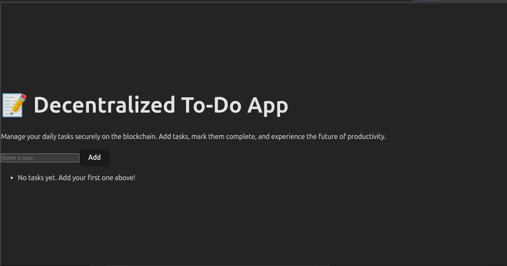

# Todo DApp

A full-stack decentralized Todo application built with Solidity, Hardhat, React, and TailwindCSS.  
This project allows users to add, view, and manage tasks directly on the blockchain.

---

## 🚀 Features
- Add tasks to the blockchain
- View all tasks stored in the contract
- Mark tasks as completed
- Professional React + Tailwind frontend
- Fully decentralized with Ethereum-compatible smart contracts

---

## 📜 Smart Contract
The smart contract is written in Solidity and deployed on **Core DAO Testnet**.

### Contract Address
```
0xfCFbe61aA22085e0db58a2c95cbF7FcC575Fe690
```

---

## 🛠️ Tech Stack
- **Smart Contracts**: Solidity, Hardhat
- **Frontend**: React (Vite) + Tailwind CSS
- **Blockchain Interaction**: Ethers.js v6
- **Wallet**: MetaMask

---

## 📂 Project Structure
```
/contracts        # Solidity smart contracts
/scripts          # Deployment scripts
/artifacts        # Compiled contract artifacts (ABI & bytecode)
/to-do/src        # React frontend source code
```

---

## ⚙️ Installation & Setup

1. Clone the repository:
   ```bash
   git clone https://github.com/bensonweb3/To-Do.git
   cd To-Do
   ```

2. Install dependencies:
   ```bash
   npm install
   ```

3. Compile the smart contract:
   ```bash
   npx hardhat compile
   ```

4. Deploy the contract (make sure your `.env` has your private key & RPC URL):
   ```bash
   npx hardhat run scripts/deploy.js --network coretestnet
   ```

5. Start the frontend:
   ```bash
   cd to-do
   npm install
   npm run dev
   ```

---

## 🖼️ Screenshots

### Dashboard  



---

## 📌 Notes
- Ensure MetaMask is connected to **Core DAO Testnet**.
- Replace placeholder screenshots with actual project images.
- The deployed address above is live and ready to interact with.

---

## 🤝 Contributing
Pull requests are welcome. For significant changes, please open an issue first to discuss what you’d like to change.

---

## 📜 License
This project is licensed under the MIT License.


